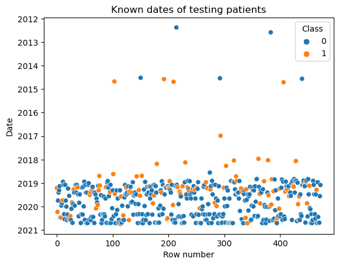
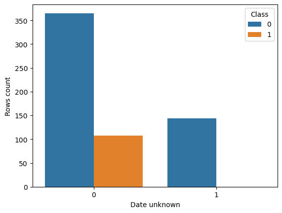

# ICR - Identifying Age-Related Conditions

This readme contains description of the competition. It also contains some of my reasonings and descriptions of tests I carried out. 

Notebook './icr-models.ipynb' contains code for achieving gold medal result on this competition, but it does not contain all the tests I conducted in developing it.  

Here is the [competition link](https://www.kaggle.com/competitions/icr-identify-age-related-conditions/overview) where all the data and additional information can be found.

Short description:
> "The competition data comprises over fifty anonymized health characteristics linked to three age-related conditions. 
>
> Your goal is to predict whether a subject has or has not been diagnosed with one of these conditions -- a binary classification problem."

## Data

In Kaggle, in most data science competitions, data is split into 3 sets:
  1. Data set provided to everyone at competition start. This set is used for training our models. 
  2. Public test data set that is not provided but all submitted models are evaluated on it and the score is visible publicly, on Leaderboard.
  3. Private test data set that is not provided and is not used until the competition ends. Upon competition ending, the private test set is used to score notebooks provided by competitors and to determine the winner. Each competitor can submit only 2 notebooks as their final solution on which they will be evaluated.
 
 

There are 617 data rows in the provided dataset and there are about 400 rows split between the public test set and the private test set. Due to low amount of data problems with overfitting were expected. Following is a preview of data:

<table border="1" class="dataframe" stype='max-width: 100%'>
  <thead>
    <tr style="text-align: right;">
      <th></th>
      <th>Id</th>
      <th>AB</th>
      <th>AF</th>
      <th>BC</th>
      <th>...</th>
      <th>GH</th>
      <th>GI</th>
      <th>GL</th>
      <th>Class</th>
    </tr>
  </thead>
  <tbody>
    <tr>
      <th>0</th>
      <td>000ff2bfdfe9</td>
      <td>0.209</td>
      <td>3109.033</td>
      <td>85.200</td>
      <td>...</td>
      <td>22.136</td>
      <td>69.835</td>
      <td>0.120</td>
      <td>1</td>
    </tr>
    <tr>
      <th>1</th>
      <td>007255e47698</td>
      <td>0.145</td>
      <td>978.764</td>
      <td>85.200</td>
      <td>...</td>
      <td>29.135</td>
      <td>32.132</td>
      <td>21.978</td>
      <td>0</td>
    </tr>
    <tr>
      <th>2</th>
      <td>013f2bd269f5</td>
      <td>0.470</td>
      <td>2635.106</td>
      <td>85.200</td>
      <td>...</td>
      <td>28.023</td>
      <td>35.193</td>
      <td>0.197</td>
      <td>0</td>
    </tr>
    <tr>
      <th>3</th>
      <td>043ac50845d5</td>
      <td>0.252</td>
      <td>3819.652</td>
      <td>120.202</td>
      <td>...</td>
      <td>39.949</td>
      <td>90.493</td>
      <td>0.156</td>
      <td>0</td>
    </tr>
    <tr>
      <th>4</th>
      <td>044fb8a146ec</td>
      <td>0.380</td>
      <td>3733.048</td>
      <td>85.200</td>
      <td>...</td>
      <td>45.381</td>
      <td>36.263</td>
      <td>0.097</td>
      <td>1</td>
    </tr>
  </tbody>
</table>

5 rows × 58 columns

 

Additional data is provided as well, but it was not available for test data. So this data can not be used in a usual way. The additional data consist of:
  * Alpha - Identifies the type of age-related condition, if present.
    * A - No age-related condition. Corresponds to class 0.
    * B, D, G - The three age-related conditions. Correspond to class 1.
  * Beta, Gamma, Delta - Three experimental characteristics.
  * Epsilon - The date the data for this subject was collected. All of the data in the test set was collected after the training set was collected.

  <table border="1" class="dataframe">
    <thead>
      <tr style="text-align: right;">
        <th></th>
        <th>Id</th>
        <th>Alpha</th>
        <th>Beta</th>
        <th>Gamma</th>
        <th>Delta</th>
        <th>Epsilon</th>
      </tr>
    </thead>
    <tbody>
      <tr>
        <th>0</th>
        <td>000ff2bfdfe9</td>
        <td>B</td>
        <td>C</td>
        <td>G</td>
        <td>D</td>
        <td>3/19/2019</td>
      </tr>
      <tr>
        <th>1</th>
        <td>007255e47698</td>
        <td>A</td>
        <td>C</td>
        <td>M</td>
        <td>B</td>
        <td>Unknown</td>
      </tr>
      <tr>
        <th>2</th>
        <td>013f2bd269f5</td>
        <td>A</td>
        <td>C</td>
        <td>M</td>
        <td>B</td>
        <td>Unknown</td>
      </tr>
      <tr>
        <th>3</th>
        <td>043ac50845d5</td>
        <td>A</td>
        <td>C</td>
        <td>M</td>
        <td>B</td>
        <td>Unknown</td>
      </tr>
      <tr>
        <th>4</th>
        <td>044fb8a146ec</td>
        <td>D</td>
        <td>B</td>
        <td>F</td>
        <td>B</td>
        <td>3/25/2020</td>
      </tr>
    </tbody>
  </table>

 

Alpha and Epsilon are the only columns I considered, because others demanded special consideration and tactics that I deemed unlikely to produce results. 
There is 144 rows with Unknown dates, and of the rest of observations the large majority is after the year 2019. Following is the plot of observations:

    

## Testing strategy

Choosing a good way to evaluate your model is of very high importance. At first, I created 10 validation folds using StratifiedKFold from sklearn, stratifying on target column (Class). This is a well known and proven strategy for validating models.

Achived scores did not correlate well with scores showed on public test sets though, and achieving a good correlation between public score and local score is of highest importance for successfully improving the models. That could mean 2 things: 
  1. models are overfitting,
  2. public test set data is different in some manner

### New validation strategy:

Considering my test data is completely independent of train and validation data and yet the local score and test score do not correlate, I designed new test strategy. 

One of the things that stood out is that column containing dates of testing patients have 144 missing values. Date of testing patients seems like a very simple information that really should be known. Upon inspecting the rows with unknown dates it showed that all of them were from healthy patients (Class=0), which seemed very suspiscious, like data could be from different source or somehow artificial. Since there was a lot less data points for dates sooner then 2019.1.1 I chose to set test data to be only rows that contain date after 2019.1.1. Count of data points with known and unknown dates:

I created 4 folds for test data from the mentioned period, and those folds were used only for testing models. Validation data used in model training remained to be derived from StratifiedKFold as before.
    

This improved correlation between local scores and public test scores somewhat, but correlation still broke as local score became better then certain value (aproximately 0.18 balanced log loss).

### Repeated testing of data

When doing repeated tests on same data we arrive at problem known as [Multiple testing problem](https://en.wikipedia.org/wiki/Multiple_comparisons_problem). Basically, if we test adding new features many times, some tests will probably improve score even if all the features tested were random.

To combat this, tests were done with 4 different seeds and hypotheses (like adding some feature for example) were accepted only if they improved score of more then 2 folds and for more then 2 of the seeds. 

Also, I rejected hypothesis if scores between folds (for different seeds) showed large variations. I did not create a formal rule for this but rather chose to accept hypotheses with best OOF score and low variations.

## Feature engineering

I tried many feature engineering strategies, but very few actually improved both public test score and local test score. 

Some of the feature engineering tactics I tried:
* Rejected:
  * Divide or multiple columns by BN column (hypthesesied to be age due to distribution)
  * Taking square and root of various columns
  * Adding operations between columns (like /,*,+,-), (prioritizing based on correlation with target)
  * Adding statistical cols like info about mean, median, quantiles, and so on.
  * Columns out of quantile ranges, and total number of columns out of different ranges
  * Adding features using Principal component analysis (PCA)
  * Imputing NaN values
  * Upsampling rows with Class 1 to the count of rows with Class 0.
  * Removing outliers (detected by how hard they are to predict)
  

* Accepted:
  * Adding logarithm and inverse of few columns (by trying all columns and checking scores with different seeds).
  * Adding small random noise (0.05 * median).
  * Undersampling Class 0 rows (there is more of them) of training sets.
  * Doubling Class 1 rows (in combination with undersampling afterwards and parameters choices, because these things can not be looked at independently without repeating all tests previously done).
  * Adding the date alike column that indicated if testing date is unknown and on what year was patient tested. 

## Models

* I tested XGBoost, LightGBM and custom NN models.
* NN models did not get comparably good results in my experiments so they were rejected.
* LightGBM models had better scores on local tests and on public test set, while XGBoost got better score on private test set.
* Provided notebook is XGBoost model I created by returning features I previosly removed during competition (as part of feature engineering). It contains training and inference code that achieves gold medal score. I avoided further submissions and experiments to avoid overfitting on the private test set.

## Some conclusions

* This was one of the competitions that had the bigest changes of scores after the competition end in Kaggle. This was largly expected at the beginning, as the data amount was quite low. In other words, it is unknown if different test data (for year 2024 for example) would yield different and random top solutions. 

* In the end, a large majority of people got worse score then one on public leaderboard or their local score. It is hard to investigate the reason for this, because private data was not provided at the end. My beleif is that the reason for this large difference in scores can be any of the following:
  1. Small dataset - models are simply not seeing the full picture. Dataset provided is covering some types of problems but not all for example.
  2. There is data shift in years 2021 and further. Covid changed types of people coming to get tested, or split chosen by organiziers resulted in some key differences in distributions, for example.
  3. There are cases that are hard to guess from information provided. Chosen metric (Balanced Log Loss) heavily punishes incorrectly predicting positive cases to be negative and so it is easy to overfit. While getting "good" local score neccesiates high probabilities for Class 1, that is exectly what will be punished when encuntering unexpected cases in private test data (that is why some of the strategies were to purposely lower scores after model inference).
  

* The top notebooks at the end seems to be tree based models that did the least amount of feature engineering, and chose the simplest models. Although this could simply be because the largest amount of competitiors did not have complex solutions and someone have to take top spots (similar to Multiple testing problem), it could also mean that the most robust models took the top places. 

* Interestingly, some (not all) of the top solutions removed the data with Unkown date completely, reducing the training data for aproximately 25%.

* The [winning solution](https://www.kaggle.com/competitions/icr-identify-age-related-conditions/discussion/430843) was different then most and so it should be mentioned. It used a DNN model similar to this [arxiv paper](https://arxiv.org/abs/1912.09363). It used no extensive feature engineering and StratifiedKFold for cross validation strategy. Model included additional target value that indicated how hard it is to predict certain rows, so that might have added robustness. 

* One of the main conclusions in this competition for me is that using only OOF validation score for hypothesis testing is not enough to avoid overfitting on small datasets.
